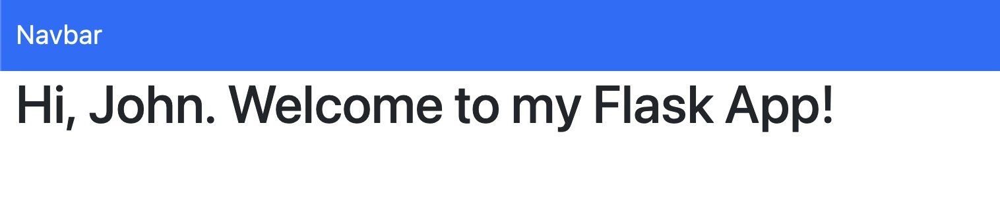

# BasicFlask

A Super simple web app skeleton built with python3 and Flask (and Bootstrap for the stylesheet and navbar)

This can be used a starting point to build and actual application 


The webapp just let's you enter your name and displays a welcome message




## Features

The App only hase three routes to handle HTTP requests. 

The home page has a button that takes you to a mock login feature that will have you enter your name and display a welcome message.

That's it.

## Templates

All the templates inherit from ``` base.html ```, for which I've taken bits and pieces from [Bootstrap](https://getbootstrap.com/)

## How to run

### Dependencies

[Flask](https://flask.palletsprojects.com/en/2.0.x/) is the only thing that is needed. So you can just:

```console
pip3 isntall Flask
```
### Run the App

clone the repo

```console
git clone https://github.com/EduardoSchiavo/BasicFlask.git
```

run the App
```console
python3 app.py
```

navigate to http://127.0.0.1:5000/ on your browser!
